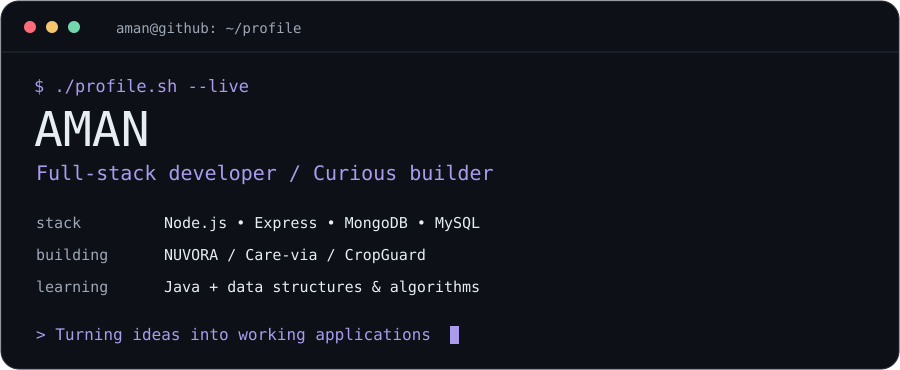
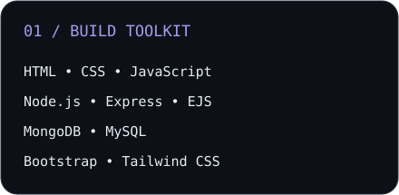
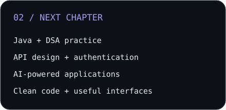
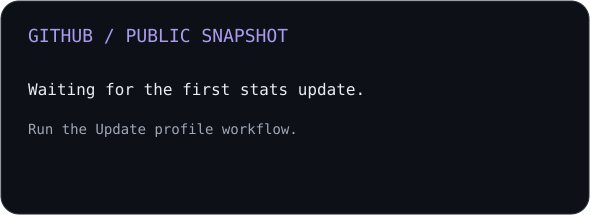
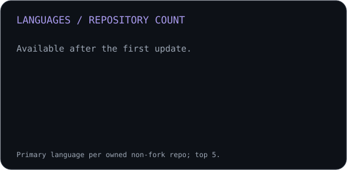

<picture>
  <source media="(prefers-color-scheme: dark)" srcset="assets/banner-dark.svg">
  <source media="(prefers-color-scheme: light)" srcset="assets/banner-light.svg">
  
</picture>

 

 

<!-- Add verified LinkedIn / portfolio links here when ready. -->

---

## A little about me

Hi, I'm **Aman**, a computer science student and full-stack developer. I enjoy turning everyday problems into web applications and understanding how each part works, from the interface to the database.

- 🛠️ I build with **JavaScript, Node.js, Express, MongoDB, and MySQL**.
- 🏡 **NUVORA:** a property-listing platform with authentication, image uploads, and maps.
- 🩺 **Care-via:** a healthcare management project for patients, doctors, and admins.
- 🌱 **CropGuard:** a crop-health project exploring image analysis and weather-based risk assessment.
- 📚 Currently strengthening my **Java and data structures & algorithms** skills.
- 🎯 Interested in **internships**, useful products, and opportunities to learn through building.

 

## My development stack

Also working with EJS, Mongoose, Cloudinary, Mapbox, and REST APIs.

---

## Building & learning

<table>
<tr>
<td width="50%" align="center">
<picture>
  <source media="(prefers-color-scheme: dark)" srcset="assets/skills-dark.svg">
  <source media="(prefers-color-scheme: light)" srcset="assets/skills-light.svg">
  
</picture>
</td>
<td width="50%" align="center">
<picture>
  <source media="(prefers-color-scheme: dark)" srcset="assets/focus-dark.svg">
  <source media="(prefers-color-scheme: light)" srcset="assets/focus-light.svg">
  
</picture>
</td>
</tr>
</table>

## Projects in focus

| Project | What I’m building | Technologies |
| --- | --- | --- |
| [NUVORA](https://github.com/aman36yt/NUVORA) | Property listings, authentication, image uploads, and location maps | Node.js · Express · EJS · MongoDB |
| Care-via | Role-based healthcare management, appointments, and medical records | JavaScript · Node.js · Express · MySQL |
| CropGuard | Crop disease detection and weather-informed risk assessment | Node.js · MongoDB · Python / AI · Weather API |

---

## My GitHub activity

<picture>
  <source media="(prefers-color-scheme: dark)" srcset="assets/stats-dark.svg">
  <source media="(prefers-color-scheme: light)" srcset="assets/stats-light.svg">
  
</picture>

  

<picture>
  <source media="(prefers-color-scheme: dark)" srcset="assets/languages-dark.svg">
  <source media="(prefers-color-scheme: light)" srcset="assets/languages-light.svg">
  
</picture>

---

Learn the fundamentals. Build something useful. Keep improving.

